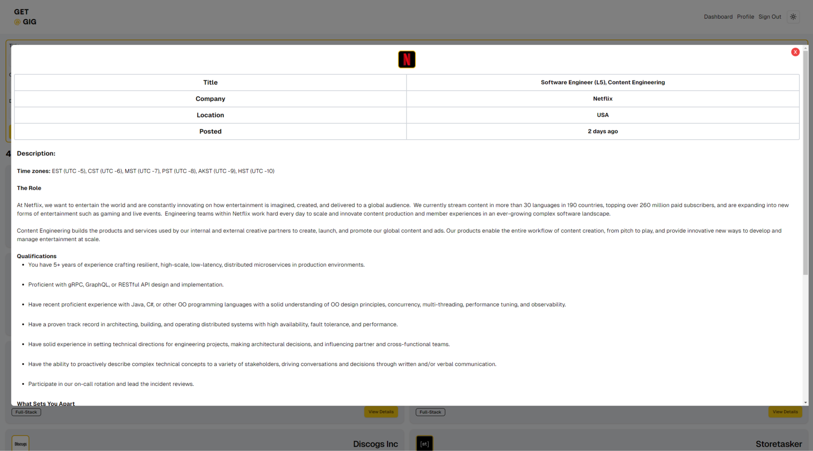
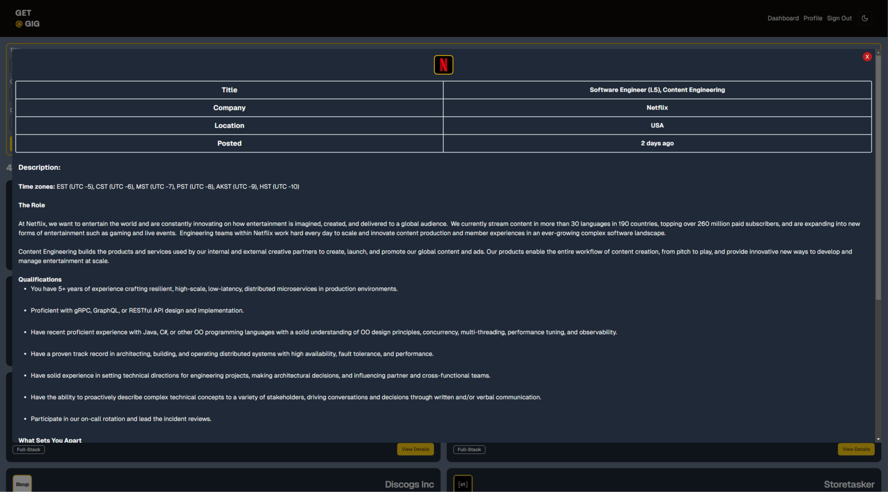

# Get A Gig

**Get A Gig** is a platform designed to connect software engineers with remote job opportunities in the tech industry. Whether you're looking for full-time positions or freelance gigs, our curated list of tech-focused roles helps you find the right match while giving you the freedom to work from anywhere.

Landing Page

## Features

- **100% Remote Jobs**  
  All the opportunities on our platform are fully remote, allowing you to choose where you want to work.

- **Tech-Focused Listings**  
  Get a Gig focuses on software engineering and tech-related job openings, ensuring you're always browsing relevant opportunities.

- **Cover Letter Generator**  
  Our built-in cover letter generator creates tailored cover letters for any job you apply to, helping you put your best foot forward.

Dark Landing Page

## How It Works

1. **Create Your Profile**  
   Start by signing up and creating a profile that highlights your skills, experience, and preferences.

Profile

2. **Explore Opportunities**  
   Browse through our curated selection of remote tech jobs to find the perfect role for you.

Dark Dashboard

3. **Apply and Connect**  
   Apply to jobs directly through the platform and connect with potential employers to discuss next steps.

Job View

## Tech Stack

- **Frontend**: Next.js, TypeScript, Tailwind CSS, Shadcn UI
- **Backend**: Prisma ORM, PostgreSQL (Neon)
- **Authentication**: NextAuth
- **Hosting**: Vercel
- **Cover Letter Generator**: Groq AI with Llama model

Cover Letter Generator

## Our Team

### Abdelrahman Hany

Abdelrahman is a former design architect turned software engineer, bringing creativity and a unique problem-solving approach to tech. His architectural background helps him design innovative digital solutions.

  
  
  
  

### Youssef Charif Hamidi

Youssef is a passionate software engineer dedicated to using technology to empower others and create meaningful opportunities. His personal journey inspires him to make a positive impact through innovation.

  
  
  
  

## Gallery

Dark Signup

Sign Up

Dark Profile

Dashboard

Dark Job View

## Thanks

Thank you for visiting **Get A Gig**! We believe in the power of remote work and are dedicated to helping you find the perfect job in tech. We’re excited to be a part of your journey toward your next great opportunity.
